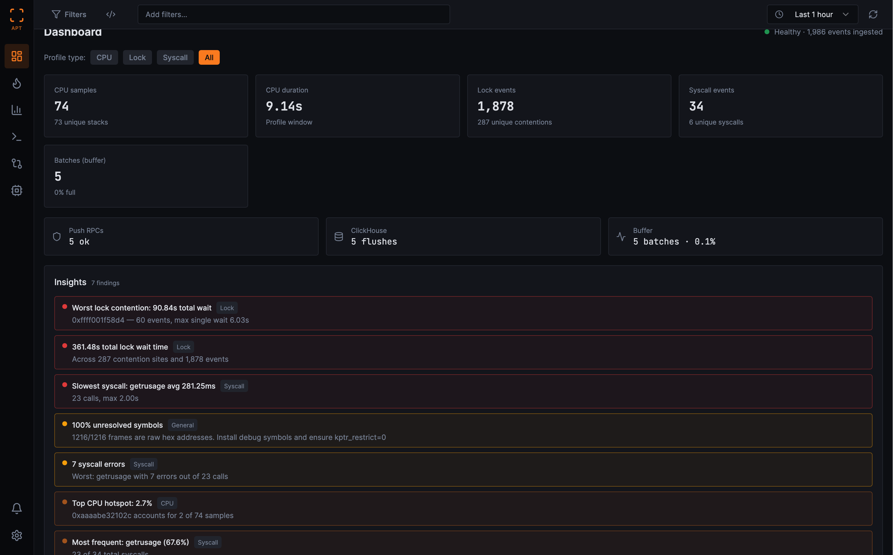

# Aperture

[](https://github.com/yourusername/aperture/actions/workflows/ci.yml)
[](https://www.rust-lang.org/)
[](#license)

> Production-grade distributed profiler for CPU & GPU workloads built with Rust and eBPF



## What is Aperture?

Aperture is a low-overhead profiling system that uses [eBPF](https://ebpf.io/) to collect performance data directly from the Linux kernel. It captures CPU stack traces, lock contention events, and syscall latencies — then aggregates, stores, and visualizes them through an interactive web dashboard.

The system follows an **agent-aggregator** architecture: lightweight agents run on target hosts collecting profiling data with less than 1% overhead, while a central aggregator service receives, stores, and serves the data via gRPC and REST APIs.

### Key Capabilities

| Capability | How it works |
| --- | --- |
| **CPU Profiling** | `perf_event` software CPU clock sampling at configurable frequency (default 99 Hz). Captures both user and kernel stack traces. |
| **Lock Contention** | Traces `futex` WAIT/WAKE operations via `sys_enter_futex`/`sys_exit_futex` tracepoints. Measures actual wait duration per lock address. |
| **Syscall Tracing** | Raw tracepoints on `sys_enter`/`sys_exit` for all syscalls. Tracks per-syscall latency distributions, error rates, and call counts. |
| **Symbol Resolution** | Automatic kernel + userspace symbol resolution using [blazesym](https://github.com/libbpf/blazesym). Resolves `/proc/kallsyms` for kernel and `/proc/PID/maps` + DWARF for userspace. |
| **Distributed Aggregation** | gRPC transport with authentication, in-memory ring buffer, and optional [ClickHouse](https://clickhouse.com/) persistence. Differential profiling across time windows. |
| **Web Dashboard** | React-based UI with interactive flamegraphs, top functions table, syscall analysis, differential profiling, timeline view, and alert management. |
| **Alert Engine** | Threshold-based alerts on buffer utilization, push errors, ClickHouse flush failures, and event throughput. REST API for rule CRUD and evaluation. |
| **Data Export** | JSON download and [Brendan Gregg collapsed-stack format](https://www.brendangregg.com/flamegraphs.html) — compatible with `flamegraph.pl`, speedscope, Grafana Pyroscope. |
| **WASM Filters** | Programmable event filtering with WebAssembly ([wasmtime](https://wasmtime.dev/)). Fuel-limited execution, sandboxed memory, no host access. |
| **Prometheus Metrics** | Built-in `/metrics` endpoint exposing push rates, buffer state, ClickHouse flush stats, and more. |

## Architecture

```text
Target Host(s)                              Aggregator
┌──────────────────────────┐    gRPC       ┌────────────────────────┐
│  ┌────────────────────┐  │──────────────▶│  gRPC Server (:50051)  │
│  │ eBPF Programs      │  │               │  HTTP/REST API (:9090) │
│  │  cpu-profiler      │  │               │  In-Memory Buffer      │
│  │  lock-profiler     │  │               │  Alert Engine          │
│  │  syscall-tracer    │  │               │  ClickHouse (optional) │
│  └────────┬───────────┘  │               └───────────┬────────────┘
│           ▼              │                           │
│  ┌────────────────────┐  │                           │ REST API
│  │ aperture-agent     │  │                           ▼
│  │  Symbol Resolver   │  │               ┌────────────────────────┐
│  │  WASM Filter (opt) │  │               │  Web Dashboard (React) │
│  └────────────────────┘  │               │  Flamegraphs, Top Fn,  │
└──────────────────────────┘               │  Syscalls, Diff, Alerts│
                                           └────────────────────────┘
```

## Quick Start

### Prerequisites

- **Linux** with kernel 5.10+ (for eBPF) — agents run on Linux only
- **Root access** on the profiling host (eBPF requires `CAP_BPF` or root)
- **Rust stable** toolchain (the aggregator, CLI, and shared crates build on any platform)
- **Rust nightly** + `rust-src` component (for eBPF programs only)
- **Node.js 18+** (for the web dashboard)

### Option 1: Docker (full stack)

The easiest way to get everything running:

```bash
git clone https://github.com/hamzzy/Aperture.git
cd aperture
docker compose up -d    # Starts ClickHouse + Aggregator + Agent
```

This brings up:

- **ClickHouse** on `:8123` (HTTP) and `:9000` (native)
- **Aggregator** on `:9090` (REST API) and `:50051` (gRPC)
- **Agent** pushing CPU profiles to the aggregator

Then start the dashboard:

```bash
cd ui && npm install && npm run dev
# Open http://localhost:5173
```

### Option 2: Install from release

```bash
curl -fsSL https://raw.githubusercontent.com/hamzzy/aperture/main/scripts/install.sh | bash
```

Downloads the latest release binaries for your architecture (`x86_64` or `aarch64`) and installs to `/usr/local/bin`.

### Option 3: Build from source

```bash
git clone https://github.com/hamzzy/aperture.git
cd aperture

# Build aggregator + CLI (any platform)
cargo build --release --bin aperture-aggregator --bin aperture-cli

# Build eBPF programs (Linux, requires nightly)
rustup install nightly && rustup component add rust-src --toolchain nightly
cargo +nightly build -Zbuild-std=core --target bpfel-unknown-none \
  --bin cpu-profiler --bin lock-profiler --bin syscall-tracer --release

# Build agent (Linux only)
cargo build --release --bin aperture-agent
```

### Run a Local Profile

Generate a flamegraph SVG without any aggregator:

```bash
sudo ./target/release/aperture-agent --mode cpu --duration 30s --output flamegraph.svg
```

### Run with Aggregator

```bash
# Terminal 1: Start ClickHouse
docker compose up -d clickhouse

# Terminal 2: Start aggregator
export APERTURE_CLICKHOUSE_ENDPOINT="http://127.0.0.1:8123"
export APERTURE_CLICKHOUSE_DATABASE="aperture"
cargo run --release -p aperture-aggregator --features clickhouse-storage

# Terminal 3: Start agent (Linux, requires root)
sudo ./target/release/aperture-agent \
  --mode all \
  --aggregator http://localhost:50051 \
  --duration 1h

# Terminal 4: Start dashboard
cd ui && npm install && npm run dev
```

## Agent Usage

```bash
# CPU profiling at 99 Hz, system-wide
sudo aperture-agent --mode cpu --duration 30s --aggregator http://HOST:50051

# CPU profiling for a specific process
sudo aperture-agent --mode cpu --pid 1234 --duration 5m --aggregator http://HOST:50051

# Lock contention tracing
sudo aperture-agent --mode lock --duration 30s --aggregator http://HOST:50051

# Syscall latency tracing
sudo aperture-agent --mode syscall --duration 30s --aggregator http://HOST:50051

# All modes simultaneously
sudo aperture-agent --mode all --duration 1h --aggregator http://HOST:50051

# Local flamegraph (no aggregator)
sudo aperture-agent --mode cpu --duration 30s --output flamegraph.svg
```

### Agent Modes

| Mode | Flag | What it collects |
| ---- | ---- | ---------------- |
| CPU | `--mode cpu` | Stack traces via perf_event sampling (default 99 Hz) |
| Lock | `--mode lock` | Futex wait/wake events with hold durations |
| Syscall | `--mode syscall` | Per-syscall latency, error codes, call counts |
| All | `--mode all` | All three modes running concurrently |

### CLI

```bash
# Query the in-memory buffer
aperture-cli query --endpoint http://127.0.0.1:50051 --limit 10

# Aggregate CPU events from storage
aperture-cli aggregate --endpoint http://127.0.0.1:50051 --event_type cpu --limit 100

# Differential profiling (compare two time windows)
aperture-cli diff --endpoint http://127.0.0.1:50051 --event_type cpu --limit 100
```

## Configuration

### Environment Variables

| Variable | Default | Description |
| -------- | ------- | ----------- |
| `APERTURE_AUTH_TOKEN` | — | Bearer token for gRPC authentication |
| `APERTURE_CLICKHOUSE_ENDPOINT` | — | ClickHouse HTTP URL (enables persistence) |
| `APERTURE_CLICKHOUSE_DATABASE` | `aperture` | ClickHouse database name |
| `APERTURE_CLICKHOUSE_PASSWORD` | — | ClickHouse password |
| `APERTURE_ADMIN_LISTEN` | `0.0.0.0:9090` | HTTP admin/API bind address |
| `APERTURE_AGGREGATOR_LISTEN` | `0.0.0.0:50051` | gRPC bind address |


## Documentation

Full documentation is available at the [Docusaurus site](docs-site/) (`cd docs-site && npm start`):

- **[Getting Started](docs-site/docs/getting-started.md)** — Installation, first profile, full stack setup
- **[Architecture](docs-site/docs/architecture.md)** — System design, data flow, eBPF programs, BPF maps
- **[API Reference](docs-site/docs/api-reference.md)** — REST endpoints, gRPC RPCs, Prometheus metrics
- **[Run Examples](docs-site/docs/guides/run-examples.md)** — Docker, OrbStack, CLI usage scenarios
- **[Symbol Resolution](docs-site/docs/guides/symbol-resolution.md)** — Fixing unresolved hex addresses
- **[WASM Filters](docs-site/docs/guides/wasm-filters.md)** — Writing custom event filters
- **[Kubernetes](docs-site/docs/guides/kubernetes.md)** — DaemonSet + Deployment manifests
- **[Alerting](docs-site/docs/guides/alerting.md)** — Threshold rules, evaluation, REST API
- **[Roadmap](docs-site/docs/roadmap.md)** — Development phases and future plans

## Contributing

Contributions are welcome. Please read [CONTRIBUTING.md](CONTRIBUTING.md) before submitting a pull request.

**Quick version:**

1. Fork the repo and create a feature branch from `main`
2. Make your changes — run `cargo fmt`, `cargo clippy`, and `cargo test` before committing
3. Open a pull request with a clear description of what changed and why

See [CONTRIBUTING.md](CONTRIBUTING.md) for the full development setup, coding standards, and PR process.

## License

Licensed under either of:

- Apache License, Version 2.0 ([LICENSE-APACHE](LICENSE-APACHE) or <http://www.apache.org/licenses/LICENSE-2.0>)
- MIT License ([LICENSE-MIT](LICENSE-MIT) or <http://opensource.org/licenses/MIT>)

at your option.

### Contribution License

Unless you explicitly state otherwise, any contribution intentionally submitted for inclusion in the work by you, as defined in the Apache-2.0 license, shall be dual licensed as above, without any additional terms or conditions.

## Acknowledgments

Built with:

- [Aya](https://aya-rs.dev/) — Rust eBPF library
- [blazesym](https://github.com/libbpf/blazesym) — Symbol resolution
- [Tokio](https://tokio.rs/) — Async runtime
- [Tonic](https://github.com/hyperium/tonic) — gRPC framework
- [wasmtime](https://wasmtime.dev/) — WebAssembly runtime
- [ClickHouse](https://clickhouse.com/) — Column-oriented analytics database
- [Inferno](https://github.com/jonhoo/inferno) — Flamegraph generation
- [React](https://react.dev/) + [Vite](https://vitejs.dev/) + [shadcn/ui](https://ui.shadcn.com/) — Web dashboard
- [Docusaurus](https://docusaurus.io/) — Documentation site
